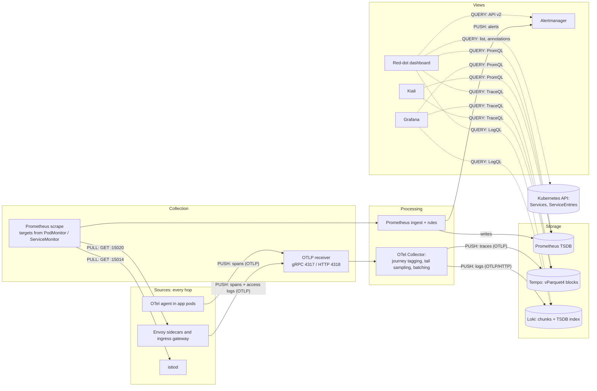
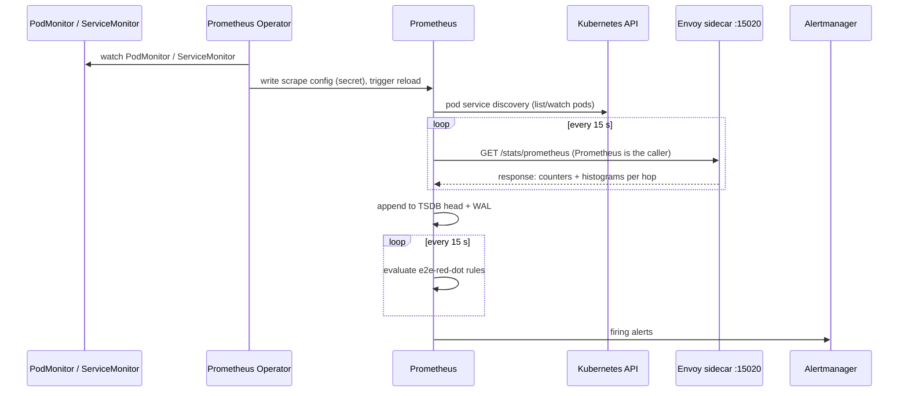
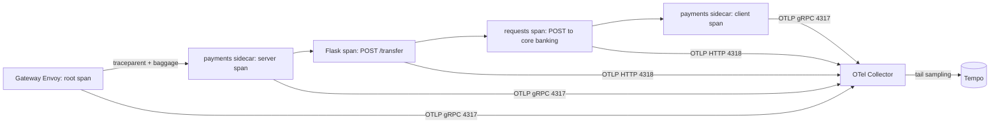
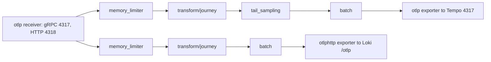
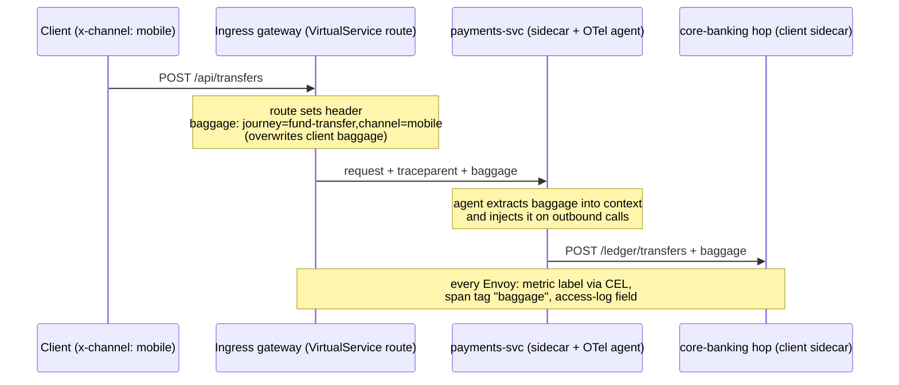
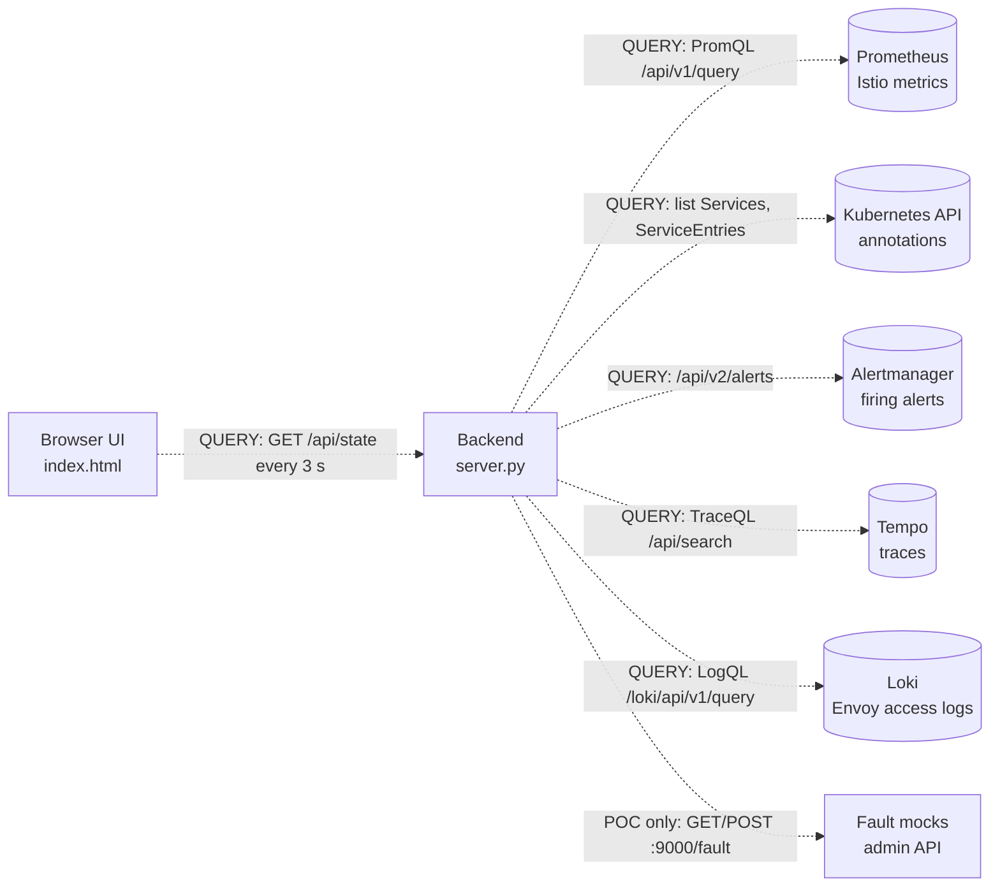
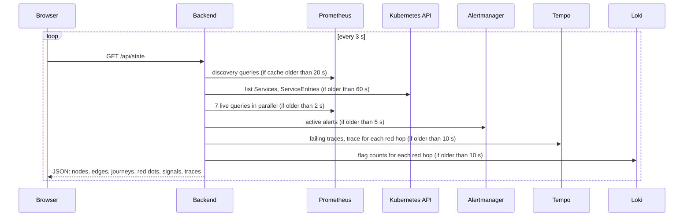
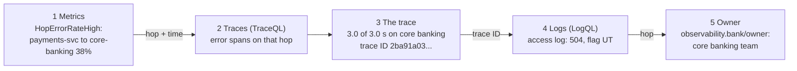
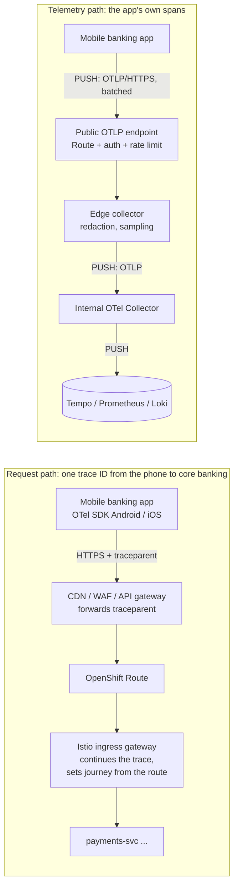

# E2E observability: how it works (technical deep dive)

This document explains, in technical terms, how the "find the red dot" stack collects,
processes, stores and visualizes telemetry. It describes the local kind POC, which runs the
upstream projects behind the OpenShift observability stack with the same CRDs. Every number
quoted here was measured on that POC. For the component-by-component move to OpenShift, see
[openshift-mapping.md](openshift-mapping.md); for operating procedures, see [runbook.md](runbook.md).

Contents

0. [Concepts: metrics, logs, traces, OpenTelemetry, trace context](#0-concepts)
1. [Architecture overview](#1-architecture-overview)
2. [Technology stack](#2-technology-stack)
3. [Signal sources: Envoy and the OTel agent](#3-signal-sources-envoy-and-the-otel-agent)
4. [Metrics pipeline (pull)](#4-metrics-pipeline-pull)
5. [Traces pipeline (push)](#5-traces-pipeline-push)
6. [Logs pipeline (push)](#6-logs-pipeline-push)
7. [Inside the OpenTelemetry Collector](#7-inside-the-opentelemetry-collector)
8. [Journey tagging end to end](#8-journey-tagging-end-to-end)
9. [External systems without agents](#9-external-systems-without-agents)
10. [Storage: where each signal lives](#10-storage-where-each-signal-lives)
11. [Alerting](#11-alerting)
12. [Visualization and correlation](#12-visualization-and-correlation)
13. [The red-dot dashboard: data sources and processing](#13-the-red-dot-dashboard-data-sources-and-processing)
14. [Ports and protocols](#14-ports-and-protocols)
15. [Data protection](#15-data-protection)
16. [Measured results](#16-measured-results)
17. [Known limits and production gaps](#17-known-limits-and-production-gaps)
18. [Correlation: following one failure across signals](#18-correlation-following-one-failure-across-signals)
19. [Phase 2: adding the mobile banking app](#19-phase-2-adding-the-mobile-banking-app)

---

## 0. Concepts

### Metrics, logs and traces

| | Metrics | Traces | Logs |
|---|---|---|---|
| What it is | Numbers aggregated over time: counters and histograms with labels, sampled every 15 s | One request followed end to end: a tree of spans that share a trace ID | One record per event: timestamp, text, fields |
| Example here | `istio_requests_total{source_workload="payments-svc", destination_service_name="core-banking", response_code="504"}` | gateway → payments-svc → core banking, 3.0 s of 3.0 s on the last hop | `"POST /ledger/transfers" 504 UT upstream=core-banking 3001ms trace_id=2ba91a03...` |
| Cost | Cheap: one time series per label combination, not per request | Medium: we keep errors and about 10% (tail sampling) | Highest volume: one line per request |
| Answers | **That** something is wrong, and on which hop | **Where** the time went inside one transaction | **Why**: response flag, upstream, error detail |
| Store / query | Prometheus / PromQL | Tempo / TraceQL | Loki / LogQL |

Metrics find the red dot, traces show where the time went, logs say why. They are linked by
shared keys (section 18).

### OpenTelemetry (and OpenTracing)

- **OpenTracing** (2016) was a vendor-neutral *API* for tracing. **OpenCensus** (2018, Google)
  covered metrics and tracing with its own SDKs. In 2019 they **merged into OpenTelemetry**
  (CNCF). OpenTracing was archived in 2022; new work uses OpenTelemetry.
- OpenTelemetry defines:
  - the **API** (create spans, metrics, logs) and the **SDK** (sampling, batching, exporting);
  - **auto-instrumentation agents** that wrap common frameworks (Flask, `requests`, JDBC)
    without code changes and propagate context;
  - **OTLP**, one wire protocol for all three signals over gRPC (4317) or HTTP (4318);
  - the **Collector**: receivers → processors → exporters;
  - **semantic conventions**: standard attribute names (`service.name`,
    `http.status_code`, `db.system`).
- In this stack: Envoy speaks OTLP natively (mesh spans and access logs), the OpenTelemetry
  Operator injects the agent into app pods, and the Collector tags, samples and routes
  everything to Tempo and Loki. Because everything speaks OTLP, any backend can be swapped.

### Trace context: trace ID, span ID, traceparent, baggage

- A **span** is one operation: name, start time, duration, status, attributes, its own
  **span ID** (8 bytes) and the span ID of its **parent**.
- A **trace** is all spans with the same **trace ID** (16 bytes, 32 hex characters). The first
  hop that sees the request (the ingress gateway) creates it at random; every later hop reuses it.
- **Context propagation**: every outbound call carries the W3C `traceparent` header, so the next
  hop knows which trace and which parent span it belongs to:

  ```text
  traceparent: 00-f0b9839816c71c1a6d5cf853fd44ea44-c5a7545b5b936a12-01
               |  |                                |                |
               |  trace-id (16 bytes, same for     parent-id        flags (01 = sampled)
               |  the whole transaction)           (8 bytes: the
               version                             CALLER's span ID)
  ```

- Envoy creates and forwards `traceparent` for traffic it proxies. The app must copy it from
  the incoming request to its outgoing calls; the OTel agent does that. A service without the
  agent breaks the trace in two, even inside the mesh.
- **Where the span ID is**: the header's `parent-id` field *is* a span ID: the span ID of the
  caller. Each hop reads it, creates a **new** span ID for its own span, records the incoming
  value as that span's parent, and writes **its own** span ID into the header of the next call.
  The trace ID never changes; the `parent-id` changes on every hop.

  Worked example: payments-svc calls notify-svc (real trace `f0b9839816c71c1a6d5cf853fd44ea44`
  from the POC, 200 ms end to end):

  | # | Span (who records it) | Span ID | Parent span ID | `parent-id` it writes on its outgoing call |
  |---|---|---|---|---|
  | 1 | ingress gateway, server | `3883effb70da8a5c` | (root) | |
  | 2 | ingress gateway, client | `e9c757822d8649cc` | `3883effb70da8a5c` | `e9c757822d8649cc` |
  | 3 | payments sidecar, server | `55692cc06a0eeb9e` | `e9c757822d8649cc` | `55692cc06a0eeb9e` (to the app) |
  | 4 | payments app, `POST /transfer` (OTel agent) | `f8fea851cf1486e0` | `55692cc06a0eeb9e` | |
  | 5 | payments app, call core banking (agent) | `70f5a1ed76dfd980` | `f8fea851cf1486e0` | `70f5a1ed76dfd980` |
  | 7 | payments app, call notify-svc (agent) | `c5a7545b5b936a12` | `f8fea851cf1486e0` | **`c5a7545b5b936a12`** |
  | 8 | payments sidecar, client to notify | `a3583a0a25b8976b` | **`c5a7545b5b936a12`** | `a3583a0a25b8976b` |
  | 9 | notify sidecar, server | `1f72f872e5221901` | `a3583a0a25b8976b` | `1f72f872e5221901` (to the app) |
  | 10 | notify app, `POST /notify` (agent) | `6ffc79c30976757e` | `1f72f872e5221901` | |

  The step that needs the agent is 4 → 7: the incoming request and the outgoing call to notify
  are two unrelated connections for Envoy. Only the code inside payments-svc knows that one
  caused the other. The agent keeps the current span in the request's execution context (a
  Python `contextvar`, a Java thread-local) and writes it into the outgoing header. Without the
  agent, notify-svc's sidecar would receive no `traceparent` and start a new trace. Rows 5 and 7
  share parent 4, so they are siblings: the two calls payments-svc makes.
- **Where a component's own span ID lives.** A `traceparent` header only ever carries one span
  ID: the sender's. A component's own span ID is *not* in the request it receives; it does not
  exist yet, the component generates it. It then appears in two places: in the **span record**
  the component sends to the collector, and in the **header of its next outgoing call**.
  Example, the payments sidecar on the call to notify:

  ```text
                         +-------------------------------+
   incoming header       |  payments sidecar (Envoy)     |      outgoing header
   traceparent:          |                               |      traceparent:
   00-f0b98398...-       | 1 reads parent-id c5a7545b    |      00-f0b98398...-
     c5a7545b...-01 ---> | 2 generates its OWN span ID   | --->   a3583a0a...-01
     ^ the CALLER's ID   |   a3583a0a (random 8 bytes)   |        ^ MY span ID
       (my parent)       | 3 writes it into the next call|          (notify's parent)
                         +---------------+---------------+
                                         | 4 PUSH span record (OTLP) to the collector
                                         v
                          { traceId:      f0b9839816c71c1a...,
                            spanId:       a3583a0a25b8976b,   <- my own span ID lives here
                            parentSpanId: c5a7545b5b936a12,
                            name, start, duration, status, attributes }
  ```

  | Where | Which span ID it contains |
  |---|---|
  | Incoming header (`parent-id`) | the caller's, i.e. my parent |
  | My span record (in Tempo) | my own span ID **and** my parent's |
  | Outgoing header (`parent-id`) | my own, which becomes the next hop's parent |

  Think of a relay baton with one name slot: each runner reads who handed it over, notes "I got
  it from X" in their own logbook, writes their own name on the baton and passes it on. The baton
  shows only the last name; the full chain is in the logbooks, which are the span records in Tempo.
- **Baggage** is a second W3C header with `key=value` pairs that travel with the request. We
  use it for `journey` and `channel` (section 8).
- **Sampling**: the flags byte tells downstream hops whether the trace is being recorded. Envoy
  records everything; the collector decides afterwards what to keep (section 7).

### Who opens the connection: push, pull, query

In every diagram of this document and of the deck, **an arrow starts at the caller**. For a pull
or a query the data then flows back in the response, against the arrow.

| Data | Direction of data | Who opens the connection | Mechanism |
|---|---|---|---|
| Envoy metrics → Prometheus | sidecar → Prometheus | **Prometheus (pull)** | HTTP GET `:15020/stats/prometheus` every 15 s |
| istiod metrics → Prometheus | istiod → Prometheus | **Prometheus (pull)** | HTTP GET `:15014/metrics` |
| Envoy spans → Collector | sidecar → collector | **Envoy (push)** | OTLP/gRPC 4317 |
| App spans → Collector | app → collector | **OTel agent (push)** | OTLP/HTTP 4318 |
| Envoy access logs → Collector | sidecar → collector | **Envoy (push)** | OTLP/gRPC 4317 (access-log sink) |
| Collector → Tempo | collector → Tempo | **Collector (push)** | OTLP/gRPC 4317 |
| Collector → Loki | collector → Loki | **Collector (push)** | OTLP/HTTP `/otlp` |
| Alerts → Alertmanager | Prometheus → Alertmanager | **Prometheus (push)** | HTTP API v2 |
| Views ← stores | store → view | **The view (query)** | PromQL, TraceQL, LogQL over HTTP, on demand |

---

## 1. Architecture overview

Three signals leave every hop of a transaction. **Metrics are pulled** (Prometheus scrapes
each sidecar). **Traces and logs are pushed** over OTLP to one OpenTelemetry Collector, which
pushes them on to Tempo and Loki. **Views query** the stores on demand.

**Arrow convention (all diagrams): an arrow starts at the caller**, the side that opens the
connection. For PUSH the data travels along the arrow; for PULL (Prometheus scraping a sidecar)
and QUERY (a view reading a store) the data comes back against the arrow, in the response.
Unlabelled arrows are hand-offs inside one process. Dotted arrows are queries. All three carry the same keys (source, destination, journey,
trace ID), which is what lets every view jump from one signal to another.



The mesh provides the hop-level view for free: every pod already has an Envoy sidecar, so
every call between services, and every call to a system outside the cluster, is measured on
the client side without code changes. Auto-instrumentation adds what happens *inside* the app
(handler, outbound HTTP call, database query) and, crucially, forwards the trace context and
baggage, so the hops join into one trace.

## 2. Technology stack

| Job | OpenShift (target) | Local POC (upstream) | Version in POC |
|---|---|---|---|
| Service mesh (telemetry source) | OpenShift Service Mesh 3.4 | Sail Operator + Istio | Istio 1.30.5, Sail 1.31.1 |
| Mesh CNI | Istio CNI (`IstioCNI` CR) | same | 1.30.5 |
| App instrumentation | Red Hat build of OpenTelemetry | OpenTelemetry Operator | operator 0.160.0, Python agent 0.66b0 |
| Telemetry pipeline | Red Hat build of OpenTelemetry Collector | OTel Collector contrib | 0.160.0 |
| Metrics + alerting | OpenShift Monitoring, user workload monitoring (Prometheus, Thanos Querier, Alertmanager) | kube-prometheus-stack | chart 91.9.0, Prometheus 3.15, Operator 0.94 |
| Trace store | Tempo Operator (TempoMonolithic, then TempoStack) | Tempo Operator + TempoMonolithic | operator 0.22.0, Tempo 2.10.8 |
| Log store | Loki Operator (LokiStack) | Loki single binary | Loki 3.6.12 (chart 7.3.0) |
| Mesh UI | Kiali (shipped with OSSM) | Kiali Operator | 2.27.0 |
| Dashboards | Grafana Operator | Grafana (in kube-prometheus-stack) | 13.2.3 |
| NOC view | Red-dot dashboard (this repo) | same | Python stdlib |
| Webhook certificates | service-ca (built in) | cert-manager | v1.21.2 |

All versions are pinned in [`versions.mk`](../versions.mk). Istio and Kiali match OSSM 3.4.

## 3. Signal sources: Envoy and the OTel agent

### Envoy sidecar (every pod) and ingress gateway

Istio injects an `istio-proxy` container (a native sidecar: it runs as an init container with
`restartPolicy: Always`). Traffic is redirected into it by **Istio CNI**, which programs
iptables in the pod network namespace, so no privileged `istio-init` container is needed. That
is the same as on OpenShift. For every request, Envoy produces:

| Signal | How it leaves Envoy | Configured by |
|---|---|---|
| Metrics (`istio_requests_total`, `istio_request_duration_milliseconds`, `istio_tcp_*`) | Exposed on `:15020/stats/prometheus` (merged with app metrics), scraped | Istio defaults + `Telemetry` metrics overrides |
| Spans (one server span for inbound, one client span for outbound) | OTLP/gRPC to the collector, `meshConfig.extensionProviders[otel-tracing]` | `Telemetry` tracing section |
| Access log (one record per request or TCP connection) | OTLP/gRPC logs to the collector, `extensionProviders[otel-als]` | `Telemetry` accessLogging section |

`manifests/mesh/istio.yaml` (excerpt):

```yaml
meshConfig:
  enableTracing: true
  extensionProviders:
    - name: otel-tracing
      opentelemetry:
        service: otel-collector.observability.svc.cluster.local
        port: 4317
    - name: otel-als
      envoyOtelAls:
        service: otel-collector.observability.svc.cluster.local
        port: 4317
        logFormat:
          labels:
            workload: "%ENVIRONMENT(ISTIO_META_WORKLOAD_NAME)%"
            response_code: "%RESPONSE_CODE%"
            response_flags: "%RESPONSE_FLAGS%"
            upstream_cluster: "%UPSTREAM_CLUSTER%"
            trace_id: "%TRACE_ID%"
            baggage: "%REQ(BAGGAGE)%"
            # ... method, path, authority, duration, upstream_failure
```

`manifests/mesh/telemetry.yaml` turns them on mesh-wide (root namespace `istio-system`):
tracing at 100% (sampling is decided later, in the collector), access logs to OTLP (every
request) and stdout (failures only), and the `journey`/`channel` metric labels (section 8).

### OTel agent (auto-instrumentation)

The `Instrumentation` CR (`manifests/tracing/instrumentation.yaml`) plus a pod annotation
`instrumentation.opentelemetry.io/inject-python: "true"` makes the OpenTelemetry Operator's
mutating webhook:

1. add an init container that copies the Python agent into a shared volume;
2. set `PYTHONPATH` so the agent's `sitecustomize` loads before the app;
3. set `OTEL_*` variables: exporter `http://otel-collector...:4318` (OTLP/HTTP), propagators
   `tracecontext,baggage`, sampler `parentbased_always_on`, service name = deployment name.

The agent instruments Flask (server spans), `requests` (client spans) and psycopg2 (DB
spans), and propagates `traceparent` and `baggage` on every outbound call. The app code
contains **no tracing code**. The annotation `traffic.sidecar.istio.io/excludeOutboundPorts:
"4318"` keeps the span export itself out of the service graph. For Java services,
`inject-java` gives the same, plus JDBC spans.

## 4. Metrics pipeline (pull)



Direction: **pull**. Prometheus opens the connection to every sidecar; nothing in the pod sends
metrics anywhere.

**What declares the scrape.** Two CRs, both copied from the OSSM 3 documentation:

- `PodMonitor istio-proxies-monitor` (`manifests/monitoring/podmonitor-base/`), **one per mesh
  namespace** (`ns/bank`, `ns/istio-ingress`). Sidecar metrics belong to each pod, not to the
  port of one Service, so we select pods. On OpenShift user workload monitoring, a PodMonitor
  may only select pods in its own namespace, which is why it is replicated per namespace by
  kustomize.
- `ServiceMonitor istiod-monitor` in `istio-system`: istiod has a Service with a
  `http-monitoring` port (15014), so a ServiceMonitor fits.

**How the targets are found.** The Prometheus Operator watches these CRs and renders them into
Prometheus `scrape_configs` (`kubernetes_sd_configs` role `pod`/`endpoints`). The PodMonitor's
relabeling rules then:

1. `keep` only targets whose container is `istio-proxy`;
2. `keep` only pods with the `prometheus.io/scrape` annotation (Istio sets it);
3. rewrite `__address__` to `<podIP>:<prometheus.io/port>` (15020; IPv4 and IPv6 regexes);
4. drop the pod labels and add `namespace` and `pod_name`.

**What is scraped.** Every 15 s, `GET :15020/stats/prometheus`. Istio's stats extension
records, on both client and server side (`reporter="source"` / `"destination"`):

```text
istio_requests_total{reporter="source", source_workload="payments-svc",
  destination_service_name="core-banking.poc.internal", response_code="504",
  response_flags="UT", journey="fund-transfer", channel="mobile", ...}
istio_request_duration_milliseconds_bucket{..., le="2500"}    # histogram for p95
istio_tcp_connections_opened_total{..., response_flags="UF"}  # TCP hops (database)
```

The dashboards and alerts use `reporter="source"` (the client side). For calls to external
systems it is the *only* reporter, because there is no sidecar on the VM.

**Queries used.** Request rate `sum(rate(istio_requests_total[1m])) by (...)`, error rate
(5xx share of the same), p95 `histogram_quantile(0.95, sum by (le, ...)
(rate(istio_request_duration_milliseconds_bucket[1m])))`, TCP failures
`rate(istio_tcp_connections_opened_total{response_flags!="-"}[1m])`.

**kube-prometheus-stack settings** (`helm/values/kube-prometheus-stack.yaml`): the
`*SelectorNilUsesHelmValues: false` flags make Prometheus pick up monitors and rules from every
namespace without the Helm release label (OpenShift UWM behaves the same way); scrape and
evaluation interval 15 s; retention 2 days.

## 5. Traces pipeline (push)



Direction: **push** all the way: Envoy and the agent send to the collector, the collector sends
to Tempo. Views query Tempo.

1. The ingress gateway starts the trace (W3C `traceparent`) and creates the root server span
   plus a client span to the service.
2. Each sidecar creates a server span (inbound) and client spans (outbound). Envoy tags each
   span with `upstream_cluster`, `http.status_code`, `response_flags`, `istio.*`, and the raw
   `baggage` header (custom tag).
3. The agent in the app continues the same trace (parent-based sampler, so it never makes its
   own decision) and forwards `traceparent` and `baggage` to the next hop.
4. Envoy sends spans over OTLP/gRPC to `otel-collector:4317`; the Python agent sends
   OTLP/HTTP protobuf to `:4318`.
5. The collector tags the journey, tail-samples, and exports to Tempo over OTLP/gRPC.

**Complete traces** (measured): fund transfer 12 spans, balance check 5, card payment 6,
login 4. The runbook shows how to check this.

**Why tail sampling.** Sampling in Envoy (head sampling) decides before the outcome is known:
at 10% it would drop 9 of 10 error traces. So Envoy samples 100%, and the collector decides
per trace after it has seen it (section 7). Cost: every span crosses the network to the
collector. At bank scale, size the collector accordingly, or use head sampling at a higher
rate combined with tail sampling.

## 6. Logs pipeline (push)

Direction: **push**: Envoy sends to the collector, the collector sends to Loki. Views query Loki.

1. Envoy's OpenTelemetry access-log sink (`envoyOtelAls`) sends one log record per request
   (HTTP) or per connection (TCP) over OTLP/gRPC to the collector. Each record has a text body
   (`"POST /api/transfers" 504 UT outbound|80||core-banking... 3001ms`) and attributes (the
   `labels` in the provider config: workload, response_code, response_flags, upstream_cluster,
   upstream_failure, duration_ms, trace_id, baggage, ...).
2. The collector's `transform/journey` processor extracts `journey` and `channel` from
   `baggage`, then sets the resource attributes `service.name` = workload and
   `k8s.namespace.name`.
3. The `otlphttp/loki` exporter posts to Loki's native OTLP endpoint
   `http://loki.logging:3100/otlp`.
4. Loki maps the resource attributes `service.name` and `k8s.namespace.name` to **index
   labels** `service_name` and `k8s_namespace_name` (low cardinality). All other attributes
   become **structured metadata**: stored with each line, filterable, not indexed.
   (`allow_structured_metadata: true`).

Example LogQL:

```logql
{service_name="payments-svc"} | response_flags != "-"                 # failures on one workload
{k8s_namespace_name="bank"} | journey="fund-transfer" | response_code=~"5.."
sum by (response_flags) (count_over_time({service_name="accounts-svc"} | response_flags!="-" [2m]))
```

In parallel, a stdout access log (Istio's built-in `envoy` provider) is filtered to failures
only (`response.code >= 400 || response.code == 0`), so `kubectl logs <pod> -c istio-proxy`
works during an incident even without Loki.

## 7. Inside the OpenTelemetry Collector

One `OpenTelemetryCollector` CR (`manifests/tracing/otel-collector.yaml`), deployed by the
operator as a Deployment with a Service `otel-collector` (ports 4317, 4318). Image:
`opentelemetry-collector-contrib` 0.160.0.



| Component | What it does | Settings |
|---|---|---|
| `otlp` receiver | Accepts spans and logs over gRPC (Envoy) and HTTP (agents) | `0.0.0.0:4317`, `0.0.0.0:4318` |
| `memory_limiter` | Refuses data when memory crosses the limit, so a burst produces back-pressure on senders instead of an OOM kill | 80% of the container limit (768 Mi), spike 20% |
| `transform/journey` | OTTL statements: `ExtractPatterns(attributes["baggage"], "journey=(?P<journey>fund-transfer\|...)")` merged into the attributes, then `baggage` deleted. On logs it also sets `service.name` and `k8s.namespace.name` | Only the fixed journey list is accepted |
| `tail_sampling` | Buffers spans per trace ID, decides once, forwards or drops the whole trace | see below |
| `batch` | Groups data into larger requests | 1,024 items or 2 s |
| `otlp/tempo` exporter | OTLP/gRPC to Tempo's distributor | `tempo-tempo.tracing:4317`, insecure (in-cluster) |
| `otlphttp/loki` exporter | OTLP/HTTP to Loki | `http://loki.logging:3100/otlp` |

**Tail-sampling policies** (any match keeps the trace):

| Policy | Type | Keeps |
|---|---|---|
| `keep-errors` | `status_code: ERROR` | any span in error |
| `keep-5xx` | `string_attribute http.status_code =~ 5..` | 5xx on any hop |
| `keep-envoy-failure-flags` | `ottl_condition attributes["response_flags"] != "-"` | UF, UH, UT, URX, NR, ... |
| `keep-slow` | `latency > 1500 ms` | slow traces |
| `baseline-10pct` | `probabilistic 10%` | a sample of healthy traffic |

`decision_wait: 15s`, `num_traces: 20000`, and a **decision cache** (`sampled_cache_size`,
`non_sampled_cache_size`: 100,000 trace IDs each). The cache is essential: sidecars and agents
flush spans on their own timers (about 5 s), so some spans reach the collector after the
decision. Without the cache they are treated as a new trace and sampled again at 10%. In the
POC, 7 of 10 stored fund-transfer traces had only 3 of their 12 spans until the cache was
added; with it, every stored trace is complete. Measured keep rate on healthy traffic: about
9% (102 of 1,103 traces); error traces: 100%.

**Scaling.** Tail sampling needs all spans of a trace in one collector. The POC runs one
replica. To scale out, put a first tier of collectors with the `loadbalancing` exporter
(routing key = trace ID) in front of the sampling tier.

## 8. Journey tagging end to end



- **Set once, at the edge.** Each route in `manifests/bank/ingress-routes.yaml` sets
  `baggage: "journey=<journey>,channel=%REQ(x-channel)%"` (Envoy header formatting fills the
  channel). Setting the header overwrites whatever the client sent, so the journey cannot be
  spoofed.
- **Carried by the apps.** The `baggage` propagator in the agent forwards it on every outbound
  call; no code.
- **Metric label.** `Telemetry` `tagOverrides` on `REQUEST_COUNT` and `REQUEST_DURATION`
  evaluate a CEL expression on each Envoy:
  `has(request.headers.baggage) ? (request.headers['baggage'].contains('journey=fund-transfer') ? 'fund-transfer' : ... : 'other') : 'none'`.
  Values come from a **fixed list** (fund-transfer, balance-check, card-payment, login,
  loan-application, other, none), so cardinality is bounded no matter what a client sends.
- **Span attribute.** Envoy records the raw header as span tag `baggage`; the collector's OTTL
  turns it into `journey` and `channel` (TraceQL `{ span.journey = "fund-transfer" }`).
- **Log field.** The access log carries `%REQ(BAGGAGE)%`; the same OTTL extracts `journey`.
- **TCP hops** (the database) carry no headers, so they have no journey label. The dashboard
  attaches them to the journeys that reach their client.

Adding a journey is deliberate: add it to the CEL in `telemetry.yaml`, the regex in
`otel-collector.yaml`, and add a gateway route. Never put customer or account IDs in labels.

## 9. External systems without agents

External systems (core banking, card switch, database, credit bureau) run as Docker containers
on the kind network, outside the cluster. CoreDNS has a `poc.internal` zone that stands in for
corporate DNS. Nothing is installed on them; the client-side sidecar observes every call.

| System | ServiceEntry | Traffic policy | What the mesh sees |
|---|---|---|---|
| Core banking (HTTPS) | `core-banking.poc.internal`, HTTP 80, `targetPort: 8443`, `resolution: DNS` | DestinationRule `tls.mode: SIMPLE` + `credentialName: configmap://bank/core-banking-ca`; VirtualService timeout 3 s | Full HTTP: codes, latency, flags, spans. The app calls `http://`, the sidecar originates TLS |
| Card switch (HTTP) | `card-switch.poc.internal`, HTTP 80 to 8080 | Outlier detection: 3 consecutive gateway errors, eject 15 s, `maxEjectionPercent: 100` | Full HTTP; flags UF then UH when ejected |
| Database (TCP) | `bank-db.poc.internal`, TCP 5432 | connect timeout 2 s | Connections, bytes, connect failures (UF) only |
| SMS gateway | not registered | `outboundTrafficPolicy: ALLOW_ANY` | Shows as `PassthroughCluster`: an undeclared dependency |

Two Istio 1.30 behaviours we hit and that apply on OpenShift too:

- A **Secret** `credentialName` in a sidecar DestinationRule is ignored unless the rule has a
  `workloadSelector`, and the sidecar then sends **plaintext** (seen as flag `UC`). A CA is
  not secret, so we use a ConfigMap reference (`configmap://<ns>/<name>`).
- `portLevelSettings` *replace* the top-level traffic policy instead of merging with it, so a
  port-level TLS block silently drops the top-level connect timeout.

## 10. Storage: where each signal lives

| Signal | Store | Format on disk | POC storage | Retention (POC) | OpenShift production |
|---|---|---|---|---|---|
| Metrics | Prometheus | TSDB: in-memory head chunks + write-ahead log (WAL); every 2 h the head is cut into an immutable block (index + chunk files + tombstones), later compacted into larger blocks | **10 Gi persistent volume** (`storageSpec.volumeClaimTemplate`) | 2 days or 8 GB, whichever comes first | UWM Prometheus on a PVC; queries through Thanos Querier |
| Traces | Tempo (monolithic) | Incoming spans to a WAL; completed traces flushed into **Apache Parquet** blocks (`vParquet4`, columnar, one row per trace) with bloom filters for trace-ID lookups; compactor merges blocks | 5 Gi PV, `backend: local` (`/var/tempo/wal`, `/var/tempo/blocks`) | 14 days (Tempo default, 336 h) | TempoStack on S3-compatible object storage (ODF / MinIO); TempoMonolithic acceptable for the pilot |
| Logs | Loki (single binary) | Log lines grouped per stream (label set) into compressed **chunks**; a **TSDB index** maps labels to chunks; structured metadata stored with the lines | 5 Gi PV, `object_store: filesystem` (`/var/loki/chunks`) | 48 h, **enforced by the compactor** (`retention_enabled: true`, runs every 10 min, deletes 2 h after marking) | LokiStack on object storage, retention by tenant/stream |
| Alerts | Alertmanager | Notification log and silences, snapshot file | emptyDir | while firing; silences until expiry | platform or UWM Alertmanager |
| Dashboards | Grafana | Dashboards as code (ConfigMap with label `grafana_dashboard`), SQLite for users and settings | in the pod | in Git | Grafana Operator `GrafanaDashboard` CRs |

Query languages: PromQL (metrics), TraceQL (traces, `GET /api/search?q=...` on Tempo :3200),
LogQL (logs, Loki :3100).

Verified: a Prometheus sample read back identically after deleting the Prometheus pod (data on
the PVC), and Loki's running config shows `retention_enabled: true` with the compactor active.
Loki retention only works through the compactor: `limits_config.retention_period` alone is
silently ignored.

## 11. Alerting

`PrometheusRule e2e-red-dot` (`manifests/monitoring/alert-rules.yaml`), evaluated every 15 s,
`for: 1m`:

| Alert | Expression (simplified) | Severity |
|---|---|---|
| HopErrorRateHigh | 5xx / all, by source_workload and destination_service_name, `> 0.05` | critical |
| HopLatencyP95High | p95 by hop `> 1000 ms` | warning |
| HopTcpConnectFailures | TCP connections with a failure flag, `> 0` | critical |
| JourneyErrorRateHigh | 5xx / all at the gateway by journey, `> 0.05` | critical |
| JourneyLatencyP95High | p95 at the gateway by journey `> 2000 ms` | warning |

Labels `scope: hop|journey` let the dashboard pick them out. On OpenShift UWM, place rules in
the namespace whose metrics they read (hop rules per app namespace, journey rules in the
gateway namespace).

## 12. Visualization and correlation

| View | Reads | Used by | How it links on |
|---|---|---|---|
| **Kiali** 2.27 | Prometheus (graph, rates, error %), Tempo (traces per node), Istio config | Mesh engineers | Opens traces in Grafana (Tempo datasource uid `tempo`) |
| **Grafana** journey dashboard (`E2E journey drill-down`) | Prometheus, Loki, Tempo | Service owners | Journey variable from `label_values(journey)`; Loki derived field `trace_id` opens Tempo; Tempo `tracesToLogsV2` opens Loki |
| **Red-dot dashboard** | Prometheus, Tempo, Loki, Alertmanager, Kubernetes API | NOC | Every signal links to Kiali, Grafana Explore or Alertmanager |
| **Alertmanager** | Prometheus rules | On-call | Firing alerts shown in the dashboard |


## 13. The red-dot dashboard: data sources and processing

The red-dot dashboard (`apps/dashboard`) **stores no telemetry**. A small backend
(`server.py`, Python standard library only) is a read-only client of the stores the platform
already runs. On each request it queries them, joins the results into one JSON document
(`GET /api/state`), and a static page (`static/index.html`) draws it. Nothing is installed or
written anywhere; deleting the dashboard removes no data.

### 13.1 Where the data comes from



Every arrow starts at the caller: the browser calls the backend, the backend calls each store,
and the data comes back in the response. No store ever calls the dashboard.

| # | Source | Endpoint (in-cluster default; env var) | Auth | What the dashboard reads | Feeds on screen | Refresh (cache) | If it is down |
|---|---|---|---|---|---|---|---|
| 1 | **Prometheus** | `http://kps-prometheus.monitoring.svc:9090/api/v1/query` (`PROM_URL`) | none in the POC; on OpenShift Thanos needs a bearer token (small backend change, see 13.9) | Istio metrics from the client-side sidecars: `istio_requests_total`, `istio_request_duration_milliseconds_bucket`, `istio_tcp_connections_opened_total` (all `reporter="source"`) | Topology (nodes, edges, journeys), every number (req/s, error %, p95, flags, TCP), edge colours, red dot, KPIs | topology 20 s, live numbers 2 s | **Required**: `/api/state` returns 502; the UI keeps the last good view and its live indicator turns *stale* after 10 s, *down* after 30 s |
| 2 | **Kubernetes API** | `https://kubernetes.default.svc` `/api/v1/services`, `/apis/networking.istio.io/v1/serviceentries` | pod ServiceAccount token; ClusterRole `red-dot-topology-reader` (get/list only) | Annotations `observability.bank/display-name`, `description`, `owner`, `hidden` | Node names and subtitles, owner team in the evidence, hidden nodes | 60 s | Raw names (`payments-svc`, `core-banking.poc.internal`), no owner |
| 3 | **Alertmanager** | `http://kps-alertmanager.monitoring.svc:9093/api/v2/alerts?active=true&silenced=false&inhibited=false` (`ALERTMANAGER_URL`) | none in the POC | Firing alerts with label `scope` = `hop` or `journey` (rules `e2e-red-dot`) | "Alert" lines in the detection-signals panel | 5 s | No alert lines; the rest works |
| 4 | **Tempo** | `http://tempo-tempo.tracing.svc:3200/api/search` (`TEMPO_URL`) | none in the POC | TraceQL search results (trace ID, root span, duration, matching spans) | "Trace" evidence line; failing-traces list | 10 s | No trace evidence |
| 5 | **Loki** | `http://loki.logging.svc:3100/loki/api/v1/query` (`LOKI_URL`) | none in the POC | Counts of Envoy access-log lines by `response_flags` | "Access log" evidence line (flag, meaning, owner) | 10 s | No log evidence |
| 6 | Fault mocks *(POC only)* | `http://<mock>.poc.internal:9000/fault`, `/reset` (`MOCK_ADMIN_TEMPLATE`) | none | Current fault per mock | Scenario buttons and their state | 3 s | That mock shows an error state; remove on OpenShift |

The public URLs used only for links (`KIALI_PUBLIC_URL`, `GRAFANA_PUBLIC_URL`,
`PROM_PUBLIC_URL`, `ALERTMANAGER_PUBLIC_URL`) are never called by the backend; the browser opens
them when you click a signal.

### 13.2 Prometheus queries (topology and numbers)

`BY` below is `source_workload, source_workload_namespace, destination_service_name,
destination_service_namespace`. All queries use client-side metrics (`reporter="source"`),
because calls to external systems are only seen by the caller's sidecar.

**Topology discovery** (every 20 s, `DISCOVERY_WINDOW` = 15 m). A hop exists if it carried
traffic in the window, so a hop that stops completely during an outage stays on screen:

| Purpose | Query |
|---|---|
| HTTP hops, journeys, channels | `sum by (BY, destination_workload, journey, channel) (increase(istio_requests_total{reporter="source"}[15m])) > 0` |
| TCP hops (databases) | `sum by (BY, destination_workload) (increase(istio_tcp_connections_opened_total{reporter="source"}[15m])) > 0` |
| Workload → service names | `sum by (BY, destination_workload) (increase(istio_requests_total{reporter="source"}[15m])) > 0` (cached 60 s) |

**Live numbers** (every 2 s, `RATE_WINDOW` = 1 m, seven queries in parallel):

| Key | Query | Used for |
|---|---|---|
| `req` | `sum by (BY, destination_workload, journey, channel) (rate(istio_requests_total{reporter="source"}[1m]))` | req/s per hop, per journey, per channel |
| `err` | `sum by (BY, journey, channel) (rate(istio_requests_total{reporter="source", response_code=~"5.."}[1m]))` | error % (5xx / all) |
| `p95` | `histogram_quantile(0.95, sum by (le, BY) (rate(istio_request_duration_milliseconds_bucket{reporter="source"}[1m])))` | p95 per hop |
| `p95j` | same, `by (le, BY, journey)` | p95 per hop within a journey |
| `p95c` | same, `by (le, source_workload, source_workload_namespace, channel)` | p95 per channel edge (gateway) |
| `flags` | `sum by (BY, response_flags) (rate(istio_requests_total{reporter="source", response_flags!="-"}[1m])) > 0` | Envoy flags per hop (UT, UF, UH, URX, ...) |
| `tcp` | `sum by (BY, destination_workload, response_flags) (rate(istio_tcp_connections_opened_total{reporter="source"}[1m]))` | TCP connections/s and failed share (flag ≠ `-`) |
| totals | `histogram_quantile(0.95, sum by (le) (rate(istio_request_duration_milliseconds_bucket{reporter="source", source_workload=~"<gateways>"}[1m])))` | KPI p95 (cached 5 s) |

### 13.3 Kubernetes API (names and owners)

The backend lists all `Service` and `ServiceEntry` objects and keeps only annotations with the
`observability.bank/` prefix: Services are keyed by namespace and name, ServiceEntries by each
host in `spec.hosts`. These are the only Kubernetes objects it reads (ClusterRole
`red-dot-topology-reader`: `get`, `list` on `services` and `serviceentries`). It never reads
Secrets, Pods or ConfigMaps.

### 13.4 Alertmanager (alerts)

`GET /api/v2/alerts?active=true&silenced=false&inhibited=false`. Only alerts labelled
`scope: hop` or `scope: journey` are used (the five `e2e-red-dot` rules). The panel shows the
two most relevant first: alerts on the red-dot hop, then journey alerts, then critical before
warning; the rest are summarised as a count. Silenced alerts are left out, so silencing in
Alertmanager also quietens the dashboard.

### 13.5 Tempo (traces)

| Purpose | TraceQL | Window |
|---|---|---|
| Failing-traces list | `{ status = error } \| select(span.journey)` (40 most recent) | 15 min |
| Evidence for an HTTP red hop | `{ span.upstream_cluster =~ ".*<host or service>.*" && status = error }` | 5 min |
| Evidence for a TCP red hop (Envoy does not trace TCP) | `{ resource.service.name = "<client workload>" && status = error }` | 5 min |

From the newest matching trace the backend takes the trace duration and the longest matching
span. It writes "3.0 s of 3.0 s spent waiting on payments-svc to Core banking" (slow upstream),
or "the call fails after 2 ms" (refused or ejected upstream). The link opens the trace in
Grafana Explore.

### 13.6 Loki (access logs)

`sum by (response_flags) (count_over_time({service_name="<client workload>"} | upstream_cluster=~".*<host>.*" | response_flags!="-" | response_flags!="" [2m]))`

The most frequent flag is translated (UT = upstream request timeout, UF = connection failure,
UH = no healthy upstream, URX = retry limit exceeded, ...) and combined with the target's owner
annotation: "Envoy flag UT (upstream request timeout) on 412 calls in 2 min. Routed to the core
banking team." The link opens the same LogQL in Grafana Explore.

### 13.7 From raw data to the screen

1. **Identity.** Sources are named by workload, destinations by Service (or ServiceEntry
   host). Rows where `destination_workload` is known teach the mapping workload → Service, so
   both ends of a hop get the same node ID. Canonical-service labels are not used, because they
   turn `unknown` exactly when an external system fails.
2. **Topology.** Nodes are typed: gateway (`GATEWAY_WORKLOADS`), mesh service, external
   (ServiceEntry host or `PassthroughCluster`), channel (the `channel` label at the gateway).
   Services are placed by their longest call depth from the gateway. A TCP hop has no journey
   label, so it joins the journeys that reach its client. Nodes first seen after start-up get a
   *new* badge for 15 minutes.
3. **Numbers.** The live queries are summed per hop, per (hop, journey) and per channel.
   Error % = 5xx ÷ all requests (TCP: failed ÷ opened connections).
4. **State** (same thresholds as the alert rules): *bad* at error ≥ 5 %; *warn* at error ≥ 1 %,
   p95 ≥ 1 s, or any Envoy flag; otherwise healthy.
5. **Red dot.** The deepest bad hop: a bad hop whose target has no bad outgoing hop. Hops
   upstream of it, which fail only because of it, are drawn amber/red but are not the red dot.
6. **Evidence.** For each red dot the backend adds the metric line, up to two alerts, the
   Tempo line and the Loki line. Evidence calls are best effort and cached 10 s, so one failing
   source never breaks the view.

| On screen | Comes from |
|---|---|
| Nodes, edges, columns, journey buttons | Prometheus (discovery queries) + Kubernetes annotations |
| Edge colour, thickness, moving dots | Prometheus live queries (state, req/s) |
| KPI strip (req/s, error %, p95) | Prometheus, gateway hops only |
| Pulsing red node, status bar "Red dot: …" | Red-dot rule over the Prometheus numbers |
| Owner team | Kubernetes annotation `observability.bank/owner` |
| Signals: "Kiali" line | Prometheus numbers of the red hop (links to the Kiali graph) |
| Signals: "Alert" lines | Alertmanager |
| Signals: "Trace" line | Tempo |
| Signals: "Access log" line | Loki + owner annotation |
| Failing-traces list | Tempo |
| Scenario buttons | Fault mocks (POC only) |

### 13.8 Timing



The caches mean many open browsers cost the stores the same as one. From the moment a fault
starts: the edge turns red after about 30 s (1-minute rate); alerts appear after their
1-minute `for`; trace and log evidence follow within 1–2 minutes, as spans and log lines arrive.

### 13.9 Configuration and OpenShift

Everything is set by environment variables (`manifests/dashboard/dashboard.yaml`; defaults in
`server.py`): `PROM_URL`, `TEMPO_URL`, `LOKI_URL`, `ALERTMANAGER_URL`, `RATE_WINDOW` (1m),
`DISCOVERY_WINDOW` (15m), `GATEWAY_WORKLOADS` (istio-ingressgateway), `NEW_BADGE_SECONDS`
(900), plus the public link URLs. On OpenShift only the endpoints change: `PROM_URL` →
Thanos Querier (`https://thanos-querier.openshift-monitoring.svc:9091`) with a ServiceAccount
token (`cluster-monitoring-view`; the backend must be extended to send it as an
`Authorization: Bearer` header, which it does not do yet), Tempo → the TempoStack/TempoMonolithic query endpoint, Loki
→ the LokiStack gateway, Alertmanager → the platform or user-workload Alertmanager; remove
`MOCK_ADMIN_TEMPLATE` and the fault API. See `docs/openshift-mapping.md`.


## 14. Ports and protocols

| From | To | Port | Protocol | Purpose |
|---|---|---|---|---|
| Prometheus | Envoy sidecar | 15020 | HTTP | `/stats/prometheus` scrape |
| Prometheus | istiod | 15014 | HTTP | control-plane metrics |
| Envoy | OTel Collector | 4317 | OTLP/gRPC | spans and access logs |
| App OTel agent | OTel Collector | 4318 | OTLP/HTTP (protobuf) | app spans |
| OTel Collector | Tempo | 4317 | OTLP/gRPC | traces |
| OTel Collector | Loki | 3100 | OTLP/HTTP `/otlp` | logs |
| Grafana, Kiali, dashboard | Prometheus | 9090 | HTTP (PromQL) | queries (OpenShift: Thanos Querier 9091, HTTPS + token) |
| Grafana, Kiali, dashboard | Tempo | 3200 | HTTP (TraceQL) | queries |
| Grafana, dashboard | Loki | 3100 | HTTP (LogQL) | queries |
| Prometheus | Alertmanager | 9093 | HTTP | alerts |

## 15. Data protection

- Account and card numbers travel only in request bodies, never in URLs, so they never reach
  access logs, span names or metric labels. Services log masked values (`****1234`).
- Metric labels are fixed, low-cardinality values only (journey, channel).
- mTLS is STRICT in the `bank` namespace; only mesh workloads can call the services.
- No tokens, kubeconfigs, passwords or real hostnames are in the repository. Generated secrets
  and the throwaway CA live in `.tools/` (gitignored) and in Kubernetes Secrets.

## 16. Measured results

| Scenario (fault injected for real) | Red dot found | Envoy flag | Alerts fired after | Routed to |
|---|---|---|---|---|
| Core banking slow (1-4 s) | payments-svc → Core banking, 35-46% errors | UT | 82-96 s | core banking team |
| Oracle DB unreachable | accounts-svc → Oracle DB (TCP) | UF, URX | 31-91 s | DBA team |
| Card switch down | cards-svc → Card switch, 100% errors | UF, then UH | 72-96 s | card switch team |
| New service added (loans-svc + credit bureau), then broken | loans-svc → Credit bureau | UF, URX | discovered in 41 s, red dot in 31 s | credit bureau partner desk |

Tail sampling: about 9% of healthy traces kept, 100% of error traces; complete traces after
the decision-cache fix.

## 17. Known limits and production gaps

| Item | Impact | Fix |
|---|---|---|
| ~~Prometheus on emptyDir~~ (fixed) | Was: metrics lost on pod restart | Now a 10 Gi PVC; on OpenShift UWM configure storage in `user-workload-monitoring-config` |
| ~~Loki retention not enforced~~ (fixed) | Was: logs kept until the volume filled | Now compactor retention enabled; on OpenShift set retention in the LokiStack CR |
| Single collector replica | Tail sampling limited by one pod | Two-tier collectors with `loadbalancing` exporter by trace ID |
| Istio histogram buckets | p95 of a hop capped by a 3 s timeout reads about 4.7 s | Trust traces for exact durations, or add finer buckets via Telemetry API |
| TCP hops | No spans and no journey label for the database hop | JDBC spans from the Java agent on real services; access log + TCP metrics meanwhile |
| Journey list | New journeys need three edits | Intentional (bounded label cardinality) |
| Fault-injection buttons | Demo only | Remove `POST /api/faults` and the mock admin calls on OpenShift |

## 18. Correlation: following one failure across signals

Correlation works because the three signals share keys:

| Key | Where it appears | Links |
|---|---|---|
| **Hop** (`source_workload` + `destination_service_name`; `upstream_cluster` on spans and logs) | metrics, Envoy spans, access logs | an alert on a hop → the spans and log lines of that hop |
| **Trace ID** (W3C, 16 bytes) | spans, access logs (`%TRACE_ID%`) | a log line ↔ its trace, both ways |
| **Journey** (baggage → label/attribute/field) | metrics, spans, access logs | filter all three to one customer journey |
| **Time window** | all | narrow every search to the minutes of the incident |

Following the "core banking slow" failure (arrows are investigation steps, not network calls):



```text
TraceQL  { span.upstream_cluster =~ ".*core-banking.poc.internal.*" && status = error }
LogQL    {service_name="payments-svc"} | trace_id="2ba91a03eb16935db767e177972f85b8"
```

The tools turn these keys into links: Grafana's Loki data source has a derived field that opens
`trace_id` in Tempo; the Tempo data source has `tracesToLogsV2`, which opens a span's Loki lines;
Kiali opens a node's traces in Grafana; the red-dot dashboard builds all three links for the
failing hop. A future step is **exemplars** (a trace ID attached to a metric sample), which
would link a latency spike directly to an example trace.

## 19. Phase 2: adding the mobile banking app

Today the trace starts at the ingress gateway, so anything that happens on the phone or on the
internet is invisible. To start the trace at the customer's tap:



1. **Instrument the app** with the OpenTelemetry SDK: `opentelemetry-android` and
   `opentelemetry-swift`. It creates a span per user action (for example "Transfer") and
   auto-instruments the HTTP client, which injects the W3C `traceparent` header into every API call.
2. **Forward the header at the edge.** Every hop in front of OpenShift (CDN, WAF, external API
   gateway, Route) must keep `traceparent` on its header allow-list. The Istio gateway then
   *continues* the app's trace instead of starting a new one, so the phone, the network and every
   mesh hop share one trace ID.
3. **Receive the app's spans on a separate, internet-facing endpoint**: an OTLP/HTTP receiver
   behind a Route, with an app token, rate limiting and request size limits. An edge collector
   redacts (attribute allow-list), samples (all errors and crashes, about 10% of sessions) and
   forwards to the internal collector. The internal pipeline stays private.
4. **Metrics from client spans.** The collector's span-metrics connector turns client spans into
   RED metrics (by app version, OS, network type: all low cardinality) next to the mesh metrics.
   Crash reports and app logs go to Loki with the trace ID.

What we gain: per tap, time on the phone vs the network vs the bank; app errors and crashes
linked to the server trace; a red dot that can now also be "the app" or "the mobile network".

Guardrails: no account numbers, names or device identifiers in spans; the journey is still set by
the gateway from the route (the app's baggage is overwritten, as today); client-supplied trace IDs
only come from the bank's authenticated app.

Decisions to take: trust the app's trace ID (recommended, on the authenticated API), or have the
gateway start a new trace and keep the app's ID as an attribute; the OpenTelemetry SDK versus a
commercial RUM product; consent and sampling rate per app release.
