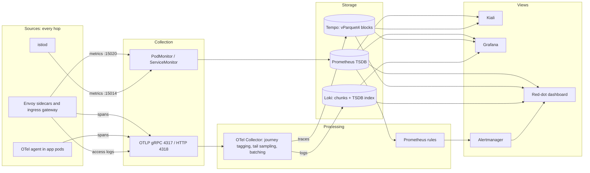
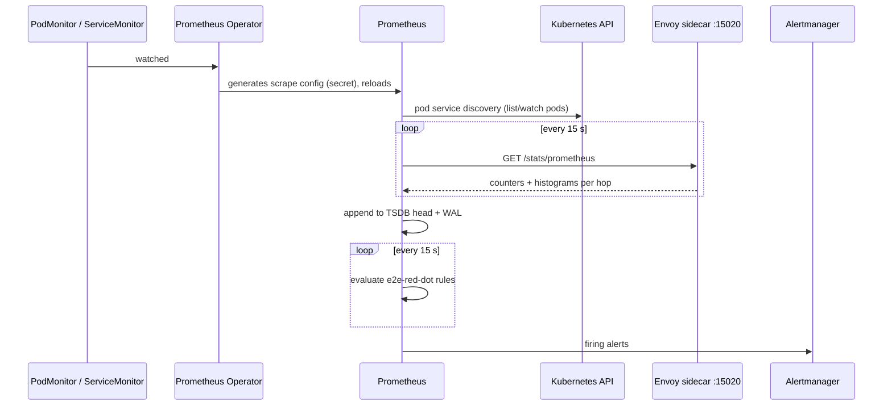
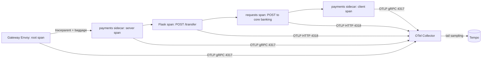
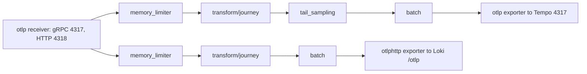
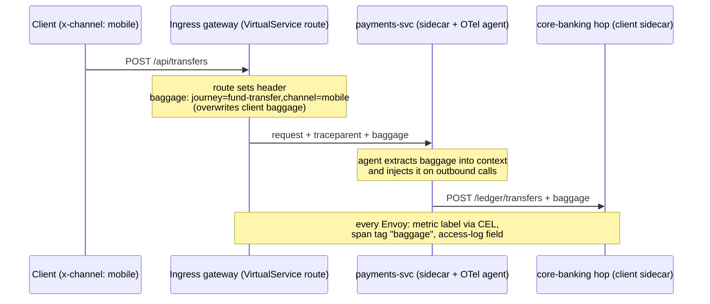
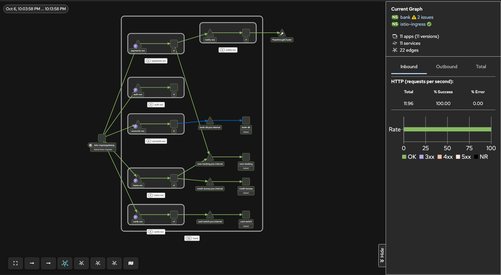
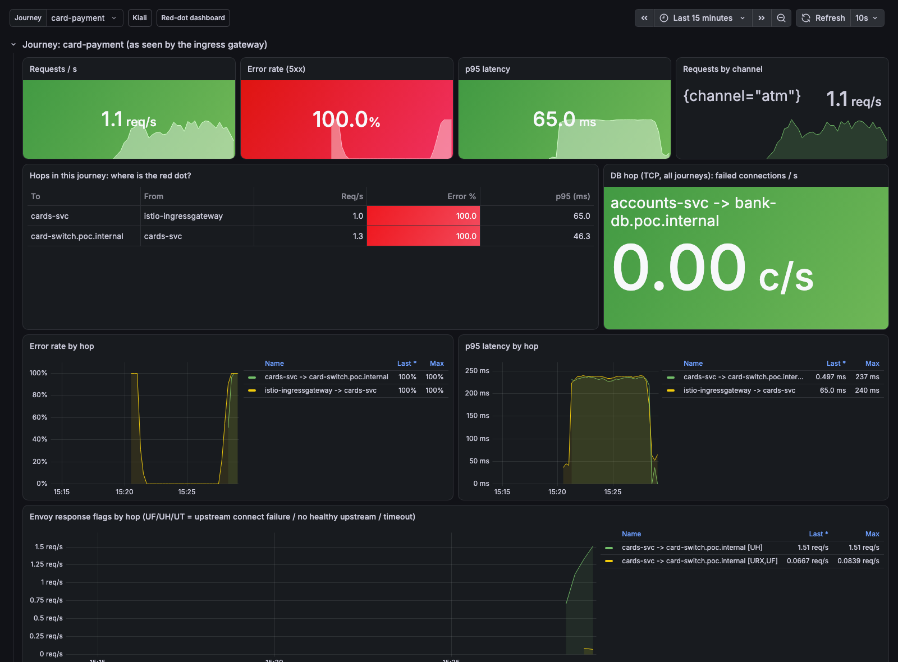
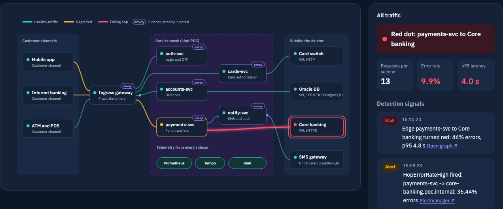

# E2E observability: how it works (technical deep dive)

This document explains, in technical terms, how the "find the red dot" stack collects,
processes, stores and visualizes telemetry. It describes the local kind POC, which runs the
upstream projects behind the OpenShift observability stack with the same CRDs. Every number
quoted here was measured on that POC. For the component-by-component move to OpenShift, see
[openshift-mapping.md](openshift-mapping.md); for operating procedures, see [runbook.md](runbook.md).

Contents

1. [Architecture overview](#1-architecture-overview)
2. [Technology stack](#2-technology-stack)
3. [Signal sources: Envoy and the OTel agent](#3-signal-sources-envoy-and-the-otel-agent)
4. [Metrics pipeline (pull)](#4-metrics-pipeline-pull)
5. [Traces pipeline (push)](#5-traces-pipeline-push)
6. [Logs pipeline (push)](#6-logs-pipeline-push)
7. [Inside the OpenTelemetry Collector](#7-inside-the-opentelemetry-collector)
8. [Journey tagging end to end](#8-journey-tagging-end-to-end)
9. [External systems without agents](#9-external-systems-without-agents)
10. [Storage: where each signal lives](#10-storage-where-each-signal-lives)
11. [Alerting](#11-alerting)
12. [Visualization and correlation](#12-visualization-and-correlation)
13. [The red-dot dashboard backend](#13-the-red-dot-dashboard-backend)
14. [Ports and protocols](#14-ports-and-protocols)
15. [Data protection](#15-data-protection)
16. [Measured results](#16-measured-results)
17. [Known limits and production gaps](#17-known-limits-and-production-gaps)

---

## 1. Architecture overview

Three signals leave every hop of a transaction. **Metrics are pulled** (Prometheus scrapes
each sidecar). **Traces and logs are pushed** over OTLP to one OpenTelemetry Collector, which
routes them to Tempo and Loki. All three carry the same keys (source, destination, journey,
trace ID), which is what lets every view jump from one signal to another.



The mesh provides the hop-level view for free: every pod already has an Envoy sidecar, so
every call between services, and every call to a system outside the cluster, is measured on
the client side without code changes. Auto-instrumentation adds what happens *inside* the app
(handler, outbound HTTP call, database query) and, crucially, forwards the trace context and
baggage, so the hops join into one trace.

## 2. Technology stack

| Job | OpenShift (target) | Local POC (upstream) | Version in POC |
|---|---|---|---|
| Service mesh (telemetry source) | OpenShift Service Mesh 3.4 | Sail Operator + Istio | Istio 1.30.5, Sail 1.31.1 |
| Mesh CNI | Istio CNI (`IstioCNI` CR) | same | 1.30.5 |
| App instrumentation | Red Hat build of OpenTelemetry | OpenTelemetry Operator | operator 0.160.0, Python agent 0.66b0 |
| Telemetry pipeline | Red Hat build of OpenTelemetry Collector | OTel Collector contrib | 0.160.0 |
| Metrics + alerting | OpenShift Monitoring, user workload monitoring (Prometheus, Thanos Querier, Alertmanager) | kube-prometheus-stack | chart 91.9.0, Prometheus 3.15, Operator 0.94 |
| Trace store | Tempo Operator (TempoMonolithic, then TempoStack) | Tempo Operator + TempoMonolithic | operator 0.22.0, Tempo 2.10.8 |
| Log store | Loki Operator (LokiStack) | Loki single binary | Loki 3.6.12 (chart 7.3.0) |
| Mesh UI | Kiali (shipped with OSSM) | Kiali Operator | 2.27.0 |
| Dashboards | Grafana Operator | Grafana (in kube-prometheus-stack) | 13.2.3 |
| NOC view | Red-dot dashboard (this repo) | same | Python stdlib |
| Webhook certificates | service-ca (built in) | cert-manager | v1.21.2 |

All versions are pinned in [`versions.mk`](../versions.mk). Istio and Kiali match OSSM 3.4.

## 3. Signal sources: Envoy and the OTel agent

### Envoy sidecar (every pod) and ingress gateway

Istio injects an `istio-proxy` container (a native sidecar: it runs as an init container with
`restartPolicy: Always`). Traffic is redirected into it by **Istio CNI**, which programs
iptables in the pod network namespace, so no privileged `istio-init` container is needed. That
is the same as on OpenShift. For every request, Envoy produces:

| Signal | How it leaves Envoy | Configured by |
|---|---|---|
| Metrics (`istio_requests_total`, `istio_request_duration_milliseconds`, `istio_tcp_*`) | Exposed on `:15020/stats/prometheus` (merged with app metrics), scraped | Istio defaults + `Telemetry` metrics overrides |
| Spans (one server span for inbound, one client span for outbound) | OTLP/gRPC to the collector, `meshConfig.extensionProviders[otel-tracing]` | `Telemetry` tracing section |
| Access log (one record per request or TCP connection) | OTLP/gRPC logs to the collector, `extensionProviders[otel-als]` | `Telemetry` accessLogging section |

`manifests/mesh/istio.yaml` (excerpt):

```yaml
meshConfig:
  enableTracing: true
  extensionProviders:
    - name: otel-tracing
      opentelemetry:
        service: otel-collector.observability.svc.cluster.local
        port: 4317
    - name: otel-als
      envoyOtelAls:
        service: otel-collector.observability.svc.cluster.local
        port: 4317
        logFormat:
          labels:
            workload: "%ENVIRONMENT(ISTIO_META_WORKLOAD_NAME)%"
            response_code: "%RESPONSE_CODE%"
            response_flags: "%RESPONSE_FLAGS%"
            upstream_cluster: "%UPSTREAM_CLUSTER%"
            trace_id: "%TRACE_ID%"
            baggage: "%REQ(BAGGAGE)%"
            # ... method, path, authority, duration, upstream_failure
```

`manifests/mesh/telemetry.yaml` turns them on mesh-wide (root namespace `istio-system`):
tracing at 100% (sampling is decided later, in the collector), access logs to OTLP (every
request) and stdout (failures only), and the `journey`/`channel` metric labels (section 8).

### OTel agent (auto-instrumentation)

The `Instrumentation` CR (`manifests/tracing/instrumentation.yaml`) plus a pod annotation
`instrumentation.opentelemetry.io/inject-python: "true"` makes the OpenTelemetry Operator's
mutating webhook:

1. add an init container that copies the Python agent into a shared volume;
2. set `PYTHONPATH` so the agent's `sitecustomize` loads before the app;
3. set `OTEL_*` variables: exporter `http://otel-collector...:4318` (OTLP/HTTP), propagators
   `tracecontext,baggage`, sampler `parentbased_always_on`, service name = deployment name.

The agent instruments Flask (server spans), `requests` (client spans) and psycopg2 (DB
spans), and propagates `traceparent` and `baggage` on every outbound call. The app code
contains **no tracing code**. The annotation `traffic.sidecar.istio.io/excludeOutboundPorts:
"4318"` keeps the span export itself out of the service graph. For Java services,
`inject-java` gives the same, plus JDBC spans.

## 4. Metrics pipeline (pull)



**What declares the scrape.** Two CRs, both copied from the OSSM 3 documentation:

- `PodMonitor istio-proxies-monitor` (`manifests/monitoring/podmonitor-base/`), **one per mesh
  namespace** (`ns/bank`, `ns/istio-ingress`). Sidecar metrics belong to each pod, not to the
  port of one Service, so we select pods. On OpenShift user workload monitoring, a PodMonitor
  may only select pods in its own namespace, which is why it is replicated per namespace by
  kustomize.
- `ServiceMonitor istiod-monitor` in `istio-system`: istiod has a Service with a
  `http-monitoring` port (15014), so a ServiceMonitor fits.

**How the targets are found.** The Prometheus Operator watches these CRs and renders them into
Prometheus `scrape_configs` (`kubernetes_sd_configs` role `pod`/`endpoints`). The PodMonitor's
relabeling rules then:

1. `keep` only targets whose container is `istio-proxy`;
2. `keep` only pods with the `prometheus.io/scrape` annotation (Istio sets it);
3. rewrite `__address__` to `<podIP>:<prometheus.io/port>` (15020; IPv4 and IPv6 regexes);
4. drop the pod labels and add `namespace` and `pod_name`.

**What is scraped.** Every 15 s, `GET :15020/stats/prometheus`. Istio's stats extension
records, on both client and server side (`reporter="source"` / `"destination"`):

```text
istio_requests_total{reporter="source", source_workload="payments-svc",
  destination_service_name="core-banking.poc.internal", response_code="504",
  response_flags="UT", journey="fund-transfer", channel="mobile", ...}
istio_request_duration_milliseconds_bucket{..., le="2500"}    # histogram for p95
istio_tcp_connections_opened_total{..., response_flags="UF"}  # TCP hops (database)
```

The dashboards and alerts use `reporter="source"` (the client side). For calls to external
systems it is the *only* reporter, because there is no sidecar on the VM.

**Queries used.** Request rate `sum(rate(istio_requests_total[1m])) by (...)`, error rate
(5xx share of the same), p95 `histogram_quantile(0.95, sum by (le, ...)
(rate(istio_request_duration_milliseconds_bucket[1m])))`, TCP failures
`rate(istio_tcp_connections_opened_total{response_flags!="-"}[1m])`.

**kube-prometheus-stack settings** (`helm/values/kube-prometheus-stack.yaml`): the
`*SelectorNilUsesHelmValues: false` flags make Prometheus pick up monitors and rules from every
namespace without the Helm release label (OpenShift UWM behaves the same way); scrape and
evaluation interval 15 s; retention 2 days.

## 5. Traces pipeline (push)



1. The ingress gateway starts the trace (W3C `traceparent`) and creates the root server span
   plus a client span to the service.
2. Each sidecar creates a server span (inbound) and client spans (outbound). Envoy tags each
   span with `upstream_cluster`, `http.status_code`, `response_flags`, `istio.*`, and the raw
   `baggage` header (custom tag).
3. The agent in the app continues the same trace (parent-based sampler, so it never makes its
   own decision) and forwards `traceparent` and `baggage` to the next hop.
4. Envoy sends spans over OTLP/gRPC to `otel-collector:4317`; the Python agent sends
   OTLP/HTTP protobuf to `:4318`.
5. The collector tags the journey, tail-samples, and exports to Tempo over OTLP/gRPC.

**Complete traces** (measured): fund transfer 12 spans, balance check 5, card payment 6,
login 4. The runbook shows how to check this.

**Why tail sampling.** Sampling in Envoy (head sampling) decides before the outcome is known:
at 10% it would drop 9 of 10 error traces. So Envoy samples 100%, and the collector decides
per trace after it has seen it (section 7). Cost: every span crosses the network to the
collector. At bank scale, size the collector accordingly, or use head sampling at a higher
rate combined with tail sampling.

## 6. Logs pipeline (push)

1. Envoy's OpenTelemetry access-log sink (`envoyOtelAls`) sends one log record per request
   (HTTP) or per connection (TCP) over OTLP/gRPC to the collector. Each record has a text body
   (`"POST /api/transfers" 504 UT outbound|80||core-banking... 3001ms`) and attributes (the
   `labels` in the provider config: workload, response_code, response_flags, upstream_cluster,
   upstream_failure, duration_ms, trace_id, baggage, ...).
2. The collector's `transform/journey` processor extracts `journey` and `channel` from
   `baggage`, then sets the resource attributes `service.name` = workload and
   `k8s.namespace.name`.
3. The `otlphttp/loki` exporter posts to Loki's native OTLP endpoint
   `http://loki.logging:3100/otlp`.
4. Loki maps the resource attributes `service.name` and `k8s.namespace.name` to **index
   labels** `service_name` and `k8s_namespace_name` (low cardinality). All other attributes
   become **structured metadata**: stored with each line, filterable, not indexed.
   (`allow_structured_metadata: true`).

Example LogQL:

```logql
{service_name="payments-svc"} | response_flags != "-"                 # failures on one workload
{k8s_namespace_name="bank"} | journey="fund-transfer" | response_code=~"5.."
sum by (response_flags) (count_over_time({service_name="accounts-svc"} | response_flags!="-" [2m]))
```

In parallel, a stdout access log (Istio's built-in `envoy` provider) is filtered to failures
only (`response.code >= 400 || response.code == 0`), so `kubectl logs <pod> -c istio-proxy`
works during an incident even without Loki.

## 7. Inside the OpenTelemetry Collector

One `OpenTelemetryCollector` CR (`manifests/tracing/otel-collector.yaml`), deployed by the
operator as a Deployment with a Service `otel-collector` (ports 4317, 4318). Image:
`opentelemetry-collector-contrib` 0.160.0.



| Component | What it does | Settings |
|---|---|---|
| `otlp` receiver | Accepts spans and logs over gRPC (Envoy) and HTTP (agents) | `0.0.0.0:4317`, `0.0.0.0:4318` |
| `memory_limiter` | Refuses data when memory crosses the limit, so a burst produces back-pressure on senders instead of an OOM kill | 80% of the container limit (768 Mi), spike 20% |
| `transform/journey` | OTTL statements: `ExtractPatterns(attributes["baggage"], "journey=(?P<journey>fund-transfer\|...)")` merged into the attributes, then `baggage` deleted. On logs it also sets `service.name` and `k8s.namespace.name` | Only the fixed journey list is accepted |
| `tail_sampling` | Buffers spans per trace ID, decides once, forwards or drops the whole trace | see below |
| `batch` | Groups data into larger requests | 1,024 items or 2 s |
| `otlp/tempo` exporter | OTLP/gRPC to Tempo's distributor | `tempo-tempo.tracing:4317`, insecure (in-cluster) |
| `otlphttp/loki` exporter | OTLP/HTTP to Loki | `http://loki.logging:3100/otlp` |

**Tail-sampling policies** (any match keeps the trace):

| Policy | Type | Keeps |
|---|---|---|
| `keep-errors` | `status_code: ERROR` | any span in error |
| `keep-5xx` | `string_attribute http.status_code =~ 5..` | 5xx on any hop |
| `keep-envoy-failure-flags` | `ottl_condition attributes["response_flags"] != "-"` | UF, UH, UT, URX, NR, ... |
| `keep-slow` | `latency > 1500 ms` | slow traces |
| `baseline-10pct` | `probabilistic 10%` | a sample of healthy traffic |

`decision_wait: 15s`, `num_traces: 20000`, and a **decision cache** (`sampled_cache_size`,
`non_sampled_cache_size`: 100,000 trace IDs each). The cache is essential: sidecars and agents
flush spans on their own timers (about 5 s), so some spans reach the collector after the
decision. Without the cache they are treated as a new trace and sampled again at 10%. In the
POC, 7 of 10 stored fund-transfer traces had only 3 of their 12 spans until the cache was
added; with it, every stored trace is complete. Measured keep rate on healthy traffic: about
9% (102 of 1,103 traces); error traces: 100%.

**Scaling.** Tail sampling needs all spans of a trace in one collector. The POC runs one
replica. To scale out, put a first tier of collectors with the `loadbalancing` exporter
(routing key = trace ID) in front of the sampling tier.

## 8. Journey tagging end to end



- **Set once, at the edge.** Each route in `manifests/bank/ingress-routes.yaml` sets
  `baggage: "journey=<journey>,channel=%REQ(x-channel)%"` (Envoy header formatting fills the
  channel). Setting the header overwrites whatever the client sent, so the journey cannot be
  spoofed.
- **Carried by the apps.** The `baggage` propagator in the agent forwards it on every outbound
  call; no code.
- **Metric label.** `Telemetry` `tagOverrides` on `REQUEST_COUNT` and `REQUEST_DURATION`
  evaluate a CEL expression on each Envoy:
  `has(request.headers.baggage) ? (request.headers['baggage'].contains('journey=fund-transfer') ? 'fund-transfer' : ... : 'other') : 'none'`.
  Values come from a **fixed list** (fund-transfer, balance-check, card-payment, login,
  loan-application, other, none), so cardinality is bounded no matter what a client sends.
- **Span attribute.** Envoy records the raw header as span tag `baggage`; the collector's OTTL
  turns it into `journey` and `channel` (TraceQL `{ span.journey = "fund-transfer" }`).
- **Log field.** The access log carries `%REQ(BAGGAGE)%`; the same OTTL extracts `journey`.
- **TCP hops** (the database) carry no headers, so they have no journey label. The dashboard
  attaches them to the journeys that reach their client.

Adding a journey is deliberate: add it to the CEL in `telemetry.yaml`, the regex in
`otel-collector.yaml`, and add a gateway route. Never put customer or account IDs in labels.

## 9. External systems without agents

External systems (core banking, card switch, database, credit bureau) run as Docker containers
on the kind network, outside the cluster. CoreDNS has a `poc.internal` zone that stands in for
corporate DNS. Nothing is installed on them; the client-side sidecar observes every call.

| System | ServiceEntry | Traffic policy | What the mesh sees |
|---|---|---|---|
| Core banking (HTTPS) | `core-banking.poc.internal`, HTTP 80, `targetPort: 8443`, `resolution: DNS` | DestinationRule `tls.mode: SIMPLE` + `credentialName: configmap://bank/core-banking-ca`; VirtualService timeout 3 s | Full HTTP: codes, latency, flags, spans. The app calls `http://`, the sidecar originates TLS |
| Card switch (HTTP) | `card-switch.poc.internal`, HTTP 80 to 8080 | Outlier detection: 3 consecutive gateway errors, eject 15 s, `maxEjectionPercent: 100` | Full HTTP; flags UF then UH when ejected |
| Database (TCP) | `bank-db.poc.internal`, TCP 5432 | connect timeout 2 s | Connections, bytes, connect failures (UF) only |
| SMS gateway | not registered | `outboundTrafficPolicy: ALLOW_ANY` | Shows as `PassthroughCluster`: an undeclared dependency |

Two Istio 1.30 behaviours we hit and that apply on OpenShift too:

- A **Secret** `credentialName` in a sidecar DestinationRule is ignored unless the rule has a
  `workloadSelector`, and the sidecar then sends **plaintext** (seen as flag `UC`). A CA is
  not secret, so we use a ConfigMap reference (`configmap://<ns>/<name>`).
- `portLevelSettings` *replace* the top-level traffic policy instead of merging with it, so a
  port-level TLS block silently drops the top-level connect timeout.

## 10. Storage: where each signal lives

| Signal | Store | Format on disk | POC storage | Retention (POC) | OpenShift production |
|---|---|---|---|---|---|
| Metrics | Prometheus | TSDB: in-memory head chunks + write-ahead log (WAL); every 2 h the head is cut into an immutable block (index + chunk files + tombstones), later compacted into larger blocks | **emptyDir** (lost if the pod restarts) | 2 days | UWM Prometheus on a PVC; queries through Thanos Querier |
| Traces | Tempo (monolithic) | Incoming spans to a WAL; completed traces flushed into **Apache Parquet** blocks (`vParquet4`, columnar, one row per trace) with bloom filters for trace-ID lookups; compactor merges blocks | 5 Gi PV, `backend: local` (`/var/tempo/wal`, `/var/tempo/blocks`) | 14 days (Tempo default, 336 h) | TempoStack on S3-compatible object storage (ODF / MinIO); TempoMonolithic acceptable for the pilot |
| Logs | Loki (single binary) | Log lines grouped per stream (label set) into compressed **chunks**; a **TSDB index** maps labels to chunks; structured metadata stored with the lines | 5 Gi PV, `object_store: filesystem` (`/var/loki/chunks`) | `retention_period: 48h` set, but **not enforced** (compactor retention not enabled) | LokiStack on object storage, retention by tenant/stream |
| Alerts | Alertmanager | Notification log and silences, snapshot file | emptyDir | while firing; silences until expiry | platform or UWM Alertmanager |
| Dashboards | Grafana | Dashboards as code (ConfigMap with label `grafana_dashboard`), SQLite for users and settings | in the pod | in Git | Grafana Operator `GrafanaDashboard` CRs |

Query languages: PromQL (metrics), TraceQL (traces, `GET /api/search?q=...` on Tempo :3200),
LogQL (logs, Loki :3100).

## 11. Alerting

`PrometheusRule e2e-red-dot` (`manifests/monitoring/alert-rules.yaml`), evaluated every 15 s,
`for: 1m`:

| Alert | Expression (simplified) | Severity |
|---|---|---|
| HopErrorRateHigh | 5xx / all, by source_workload and destination_service_name, `> 0.05` | critical |
| HopLatencyP95High | p95 by hop `> 1000 ms` | warning |
| HopTcpConnectFailures | TCP connections with a failure flag, `> 0` | critical |
| JourneyErrorRateHigh | 5xx / all at the gateway by journey, `> 0.05` | critical |
| JourneyLatencyP95High | p95 at the gateway by journey `> 2000 ms` | warning |

Labels `scope: hop|journey` let the dashboard pick them out. On OpenShift UWM, place rules in
the namespace whose metrics they read (hop rules per app namespace, journey rules in the
gateway namespace).

## 12. Visualization and correlation

| View | Reads | Used by | How it links on |
|---|---|---|---|
| **Kiali** 2.27 | Prometheus (graph, rates, error %), Tempo (traces per node), Istio config | Mesh engineers | Opens traces in Grafana (Tempo datasource uid `tempo`) |
| **Grafana** journey dashboard (`E2E journey drill-down`) | Prometheus, Loki, Tempo | Service owners | Journey variable from `label_values(journey)`; Loki derived field `trace_id` opens Tempo; Tempo `tracesToLogsV2` opens Loki |
| **Red-dot dashboard** | Prometheus, Tempo, Loki, Alertmanager, Kubernetes API | NOC | Every signal links to Kiali, Grafana Explore or Alertmanager |
| **Alertmanager** | Prometheus rules | On-call | Firing alerts shown in the dashboard |





## 13. The red-dot dashboard backend

`apps/dashboard/server.py` (Python standard library only) serves the UI and `GET /api/state`.

**Topology discovery (nothing hard-coded).** Every 20 s the backend runs:

```promql
sum by (source_workload, source_workload_namespace, destination_service_name,
        destination_service_namespace, destination_workload, journey, channel)
  (increase(istio_requests_total{reporter="source"}[15m])) > 0
```

and the same over `istio_tcp_connections_opened_total`. Each row is a hop. Node identity:
destinations are named by Kubernetes Service (or ServiceEntry host); sources only by workload,
so rows where `destination_workload` is known teach the mapping workload → service. Canonical
service labels are not used because they become `unknown` exactly when an external system
fails. Node kind: gateway (`GATEWAY_WORKLOADS`), external (ServiceEntry host or
`PassthroughCluster`), service, or channel (`channel` label at the gateway). Depth is the
longest call chain from a gateway; the UI draws columns channel | gateway | services by depth
| external. Journeys are the `journey` label values.

**Display metadata** comes from annotations, read through a read-only ClusterRole
(`services`, `serviceentries`):
`observability.bank/display-name`, `description`, `owner` (who the red dot is routed to),
`hidden`.

**Live state** (cached 2 s): request rate, 5xx %, p95 and Envoy flags per hop (1-minute
rate), per journey and per channel.

**Red-dot rule.** A hop is *bad* at error rate ≥ 5% (amber at ≥ 1% or p95 ≥ 1 s, the same
thresholds as the alerts). The red dot is the **deepest** bad hop: a bad hop whose target has
no bad outgoing hop. Upstream hops that fail only because of it are drawn amber.

**Evidence ("detection signals")** for each red dot: the metrics view (as Kiali shows it), the
two most relevant alerts, a Tempo trace
(`{ span.upstream_cluster =~ ".*core-banking.poc.internal.*" && status = error }`, showing how
much of the trace was spent on the hop), and Loki flag counts
(`sum by (response_flags)(count_over_time(... [2m]))`) with the owner team.



## 14. Ports and protocols

| From | To | Port | Protocol | Purpose |
|---|---|---|---|---|
| Prometheus | Envoy sidecar | 15020 | HTTP | `/stats/prometheus` scrape |
| Prometheus | istiod | 15014 | HTTP | control-plane metrics |
| Envoy | OTel Collector | 4317 | OTLP/gRPC | spans and access logs |
| App OTel agent | OTel Collector | 4318 | OTLP/HTTP (protobuf) | app spans |
| OTel Collector | Tempo | 4317 | OTLP/gRPC | traces |
| OTel Collector | Loki | 3100 | OTLP/HTTP `/otlp` | logs |
| Grafana, Kiali, dashboard | Prometheus | 9090 | HTTP (PromQL) | queries (OpenShift: Thanos Querier 9091, HTTPS + token) |
| Grafana, Kiali, dashboard | Tempo | 3200 | HTTP (TraceQL) | queries |
| Grafana, dashboard | Loki | 3100 | HTTP (LogQL) | queries |
| Prometheus | Alertmanager | 9093 | HTTP | alerts |

## 15. Data protection

- Account and card numbers travel only in request bodies, never in URLs, so they never reach
  access logs, span names or metric labels. Services log masked values (`****1234`).
- Metric labels are fixed, low-cardinality values only (journey, channel).
- mTLS is STRICT in the `bank` namespace; only mesh workloads can call the services.
- No tokens, kubeconfigs, passwords or real hostnames are in the repository. Generated secrets
  and the throwaway CA live in `.tools/` (gitignored) and in Kubernetes Secrets.

## 16. Measured results

| Scenario (fault injected for real) | Red dot found | Envoy flag | Alerts fired after | Routed to |
|---|---|---|---|---|
| Core banking slow (1-4 s) | payments-svc → Core banking, 35-46% errors | UT | 82-96 s | core banking team |
| Oracle DB unreachable | accounts-svc → Oracle DB (TCP) | UF, URX | 31-91 s | DBA team |
| Card switch down | cards-svc → Card switch, 100% errors | UF, then UH | 72-96 s | card switch team |
| New service added (loans-svc + credit bureau), then broken | loans-svc → Credit bureau | UF, URX | discovered in 41 s, red dot in 31 s | credit bureau partner desk |

Tail sampling: about 9% of healthy traces kept, 100% of error traces; complete traces after
the decision-cache fix.

## 17. Known limits and production gaps

| Item | Impact | Fix |
|---|---|---|
| Prometheus on emptyDir | POC metrics lost on pod restart | `prometheusSpec.storageSpec` with a PVC (OpenShift UWM: configure storage in `user-workload-monitoring-config`) |
| Loki retention not enforced | Logs kept until the 5 Gi volume fills | Enable compactor retention (`compactor.retention_enabled: true`, delete request store); on OpenShift set retention in LokiStack |
| Single collector replica | Tail sampling limited by one pod | Two-tier collectors with `loadbalancing` exporter by trace ID |
| Istio histogram buckets | p95 of a hop capped by a 3 s timeout reads about 4.7 s | Trust traces for exact durations, or add finer buckets via Telemetry API |
| TCP hops | No spans and no journey label for the database hop | JDBC spans from the Java agent on real services; access log + TCP metrics meanwhile |
| Journey list | New journeys need three edits | Intentional (bounded label cardinality) |
| Fault-injection buttons | Demo only | Remove `POST /api/faults` and the mock admin calls on OpenShift |
